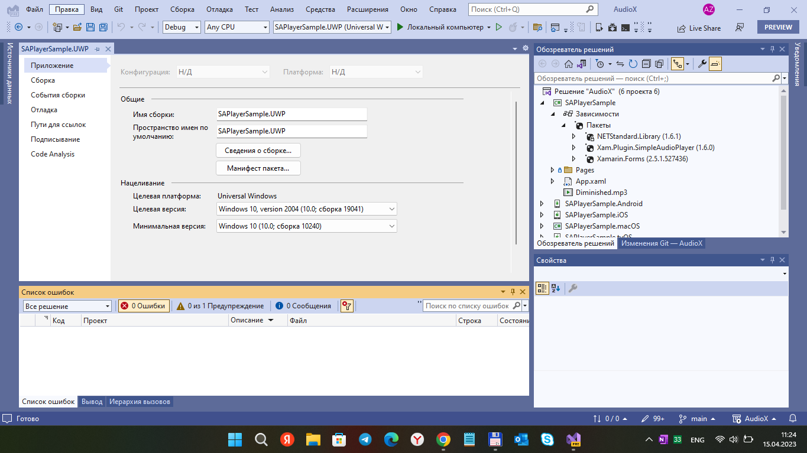
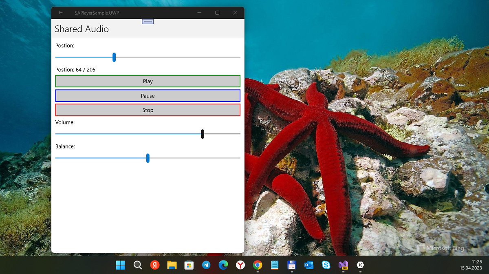

# AudioX 
A free and simple UWP based browser for Mobile (and Desktop) with a range of feature to try to improve browsing on Windows Mobile
A free and simple cross-platform "audio-subsystem" for Xamarin.Forms 2.5 and Windows 10 Mobile. Based on [https://github.com/adrianstevens/Xamarin-Plugins](https://github.com/adrianstevens/Xamarin-Plugins) solution.

## Screenshots




## Recent changes
```
- . NET Standard 2.0 -> 1.4

```


## Features
- Start
- Stop
- Pause
- "Time shift"
- Someting that I forgot ;)

## Credits
- Massive thanks to [Adrian Stevens](https://github.com/adrianstevens)
- Original source credit goes to [https://github.com/adrianstevens/Xamarin-Plugins](https://github.com/adrianstevens/Xamarin-Plugins)

